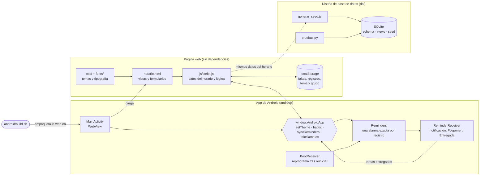

# Horario 2º ASIR

Horario del curso 2026-27 de 2.º de ASIR (clases los miércoles por la tarde, de septiembre a junio) para los grupos A y B. Registra faltas, exámenes, tareas y notas y controla la asistencia mínima del 80 % por módulo. Funciona como página web y como app de Android, sin conexión a internet.

## Qué hace

- **Trimestre**: tabla de fechas × horas. Un toque marca la falta de esa hora y un toque en la fecha marca todo el día. Pulsación larga o clic derecho para añadir un examen, una tarea o una nota. Barra de progreso de la clase en curso, con fuegos artificiales al acabar el día.
- **Mes**: calendario con los días de clase. En los días sin clase se pueden apuntar tareas y notas personales.
- **Día**: clases de una fecha, con sus registros.
- **Módulos**: docentes, aulas y horas presenciales de cada módulo.
- **Asistencia y Registros**: % de cada módulo sobre el curso completo y lista de faltas, exámenes, tareas y notas.
- Tema de noche y de día, cambio de grupo y ayuda en el menú lateral. Todo se guarda en el propio dispositivo.
- En la app de Android: recordatorios de exámenes y tareas, y vibración ligera al marcar faltas.

## Cómo encaja todo



## Estructura

| Ruta | Contenido |
|---|---|
| `horario.html` | Marcado de todas las vistas, menú lateral y diálogos |
| `js/script.js` | Datos del horario (`MODULES`, `CALENDAR_DATES`, `SCHEDULE_A/B`…) y toda la lógica |
| `css/styles.css`, `css/fonts.css` | Estilos, temas de noche y día; fuentes Geist incluidas en `fonts/` |
| `favicon.svg` | Icono de la página (el mismo dibujo que el icono de Android) |
| `android/` | App de Android: `build.sh`, código Java, recursos y manifiesto |
| `Horario.apk` | Última APK generada |
| `db/` | Modelo de base de datos del centro (SQLite), generador de datos y pruebas |
| `docs/modelo-datos.md` | Documentación del modelo: diagrama E-R, tablas y permisos por rol |
| `CLAUDE.md` | Notas técnicas detalladas del proyecto |

## Uso

**Web.** No hay que compilar nada. Se abre `horario.html` en el navegador o se sirve la carpeta:

```sh
python3 -m http.server
```

**Android.** Hace falta el JDK 17 en `~/.local/opt/jdk-17*` y el SDK de Android en `~/Android/Sdk` (`platforms;android-34`, `build-tools;34.0.0`). Sin Gradle:

```sh
android/build.sh        # genera Horario.apk e incrementa android/version.txt
```

La primera ejecución crea la clave de firma (`android/horario-release.jks` y `keystore.properties`). Todas las actualizaciones deben firmarse con ella, y **no se debe compartir**.

**Base de datos.** Hoy la app no la usa; es el diseño para gestionar el centro completo. Requiere SQLite ≥ 3.37:

```sh
node db/generar_seed.js         # regenera db/seed_2asir.sql desde js/script.js
python3 db/pruebas.py           # carga todo en memoria y comprueba las reglas
sqlite3 cifp.db < db/schema.sql && sqlite3 cifp.db < db/views.sql && sqlite3 cifp.db < db/seed_2asir.sql
```

## A tener en cuenta

- En `js/script.js`, `CALENDAR_DATES`, `SCHEDULE_A` y `SCHEDULE_B` van alineados **por posición**. Además, los registros guardados se refieren a una fecha por su posición, así que insertar o reordenar fechas mueve los datos del usuario a otros días.
- Si cambia el horario, hay que volver a generar la APK (`android/build.sh`) y los datos de la base de datos (`node db/generar_seed.js`).
- La barra **Pruebas** de la parte superior simula la hora para probar la barra de progreso de la clase en curso. Es temporal: está marcada con un comentario en `horario.html` y en `css/styles.css`.
