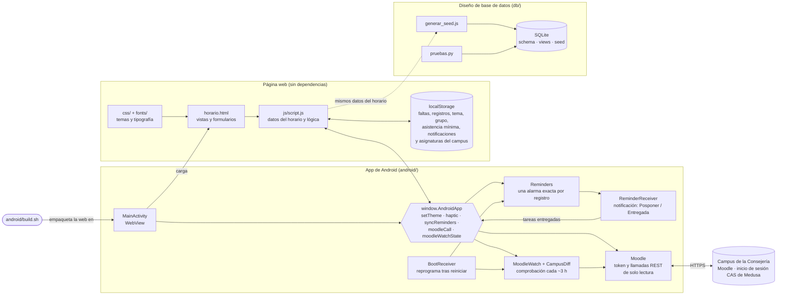

# Horario 2º ASIR

Horario del curso 2026-27 de 2.º de ASIR (clases los miércoles por la tarde, de septiembre a junio) para los grupos A y B. Registra faltas, exámenes, tareas y notas y controla la asistencia mínima de cada módulo (80 % por defecto, o la que pida su profesor). Funciona como página web y como app de Android. Todo se guarda en el propio dispositivo; la app de Android puede además conectarse al Campus de la Consejería (Moodle) para traer tareas, notas y avisos.

## Qué hace

- **Trimestre**: tabla de fechas × horas, dividida en 1<sup>er</sup> trimestre (23 sep – 13 ene), 2º (20 ene – 28 abr) y 3<sup>er</sup> (5 may – 16 jun). Un toque marca la falta de esa hora y un toque en la fecha marca todo el día. Pulsación larga o clic derecho para añadir un examen, una tarea o una nota. Botón de pantalla completa que muestra el trimestre entero, con zoom (pellizco, Ctrl + rueda o los botones − / +) y cambio de trimestre sin salir. Barra de progreso de la clase en curso, con fuegos artificiales al acabar el día.
- **Mes**: calendario con los días de clase. En los días sin clase se pueden apuntar tareas y notas personales.
- **Día**: clases de una fecha con su docente, aula y horario.
- **Módulos**: docentes, aulas y horas presenciales de cada módulo. El botón «⋯» de cada uno permite cambiar el docente y el aula, o marcarlo como convalidado o desistido para que deje de salir en el horario, la asistencia y los avisos; en la app, con la cuenta del campus conectada, también la nota de cada asignatura y su detalle.
- **Asistencia**: % de cada módulo, siempre contado sobre el curso completo. Solo salen las asignaturas del trimestre, mes o día que se está viendo. El engranaje de la caja permite cambiar la asistencia mínima de cada una (por ejemplo, 90 % si el profesor lo pide); «Resetear» las devuelve todas al 80 %.
- **Registros**: faltas, exámenes, tareas y notas, con filtros por tipo. Poner la nota de una tarea la marca como entregada. En el móvil, en Trimestre, Mes y Día, Registros va encima de Asistencia.
- **Menú lateral**: grupo, tema de noche y de día, Campus, Notificaciones y ayuda.
- En la app de Android: recordatorios de exámenes y tareas (cada uno avisa los días y a la hora que se eligen en él) y vibración ligera al marcar faltas.

### Campus (solo en la app de Android)

Se conecta con la cuenta de Medusa (el inicio de sesión se hace en la propia página del campus) y todo es de solo lectura: la app no entrega ni cambia nada en el campus.

- **Ver tareas**: lista las tareas del curso 2026-27 que siguen pendientes de entrega, con su asignatura y fecha; «Añadir tarea» la mete en el horario (en su clase si la entrega cae un miércoles con clase de esa asignatura; si no, como tarea personal de ese día). Las añadidas se ponen al día solas: entrega, nota y cambios de fecha.
- **Asignaturas**: cada curso del campus se relaciona con su asignatura una sola vez. Los que llevan el código en el nombre corto (`782NNS-IMW-2026_27`) se relacionan solos; por los demás se pregunta, y se puede cambiar en «Cambiar asignaturas».
- **Notas**: columna «Nota campus» en Módulos, con el detalle de cada calificación.
- **Avisos**: cada ~3 horas, aunque la app esté cerrada, avisa de tareas nuevas y de cambios de fecha de entrega. «Sincronizar» lo comprueba al momento.
- El estado de la conexión se ve junto al título de la sección.

### Notificaciones (menú lateral, solo en la app)

Interruptores para los recordatorios de exámenes, los de entregas de tareas y los avisos del campus (tareas nuevas y cambios de fecha por separado). Cuándo avisar (días antes y hora) se elige en cada examen o tarea. «Sonido y vibración» abre los ajustes de Android, y si Android tiene bloqueadas las notificaciones de la app, la sección lo avisa.

## Cómo encaja todo


```mermaid
flowchart LR
  subgraph web["Página web (sin dependencias)"]
    html["horario.html<br/>vistas y formularios"]
    js["js/script.js<br/>datos del horario y lógica"]
    css["css/ + fonts/<br/>temas y tipografía"]
    ls[("localStorage<br/>faltas, registros, tema, grupo,<br/>asistencia mínima, notificaciones<br/>y asignaturas del campus")]
    html --> js
    css --> html
    js <--> ls
  end

  subgraph android["App de Android (android/)"]
    main["MainActivity<br/>WebView"]
    bridge{{"window.AndroidApp<br/>setTheme · haptic · syncReminders ·<br/>moodleCall · moodleWatchState"}}
    rem["Reminders<br/>una alarma exacta por registro"]
    recv["ReminderReceiver<br/>notificación: Posponer / Entregada"]
    moodle["Moodle<br/>token y llamadas REST<br/>de solo lectura"]
    watch["MoodleWatch + CampusDiff<br/>comprobación cada ~3 h"]
    boot["BootReceiver<br/>reprograma tras reiniciar"]
    main --> bridge
    bridge --> rem
    rem --> recv
    bridge --> moodle
    bridge --> watch
    watch --> moodle
    boot --> rem
    boot --> watch
    recv -- "tareas entregadas" --> bridge
  end

  campus[("Campus de la Consejería<br/>Moodle · inicio de sesión CAS de Medusa")]
  moodle <-- "HTTPS" --> campus

  subgraph db["Diseño de base de datos (db/)"]
    gen["generar_seed.js"]
    sql[("SQLite<br/>schema · views · seed")]
    tests["pruebas.py"]
    gen --> sql
    tests --> sql
  end

  build(["android/build.sh"]) -- "empaqueta la web en" --> main
  main -- "carga" --> html
  js <--> bridge
  js -. mismos datos del horario .-> gen
```

## Estructura

| Ruta | Contenido |
|---|---|
| `horario.html` | Marcado de todas las vistas, menú lateral y diálogos |
| `js/script.js` | Datos del horario (`MODULES`, `CALENDAR_DATES`, `SCHEDULE_A/B`…) y toda la lógica |
| `css/styles.css`, `css/fonts.css` | Estilos, temas de noche y día; fuentes Geist incluidas en `fonts/` |
| `favicon.svg` | Icono de la página (el mismo dibujo que el icono de Android) |
| `android/` | App de Android: `build.sh`, código Java (incluida la conexión con el campus), recursos y manifiesto |
| `android/test/` | Prueba de `CampusDiff` (qué avisos del campus corresponden), con el JDK a secas |
| `Horario.apk` | Última APK generada |
| `db/` | Modelo de base de datos del centro (SQLite), generador de datos y pruebas |
| `docs/modelo-datos.md` | Documentación del modelo: diagrama E-R, tablas y permisos por rol |
| `CLAUDE.md` | Notas técnicas detalladas del proyecto |

## Uso

**Web.** No hay que compilar nada. Se abre `horario.html` en el navegador o se sirve la carpeta:

```sh
python3 -m http.server
```

**Android.** Hace falta el JDK 17 en `~/.local/opt/jdk-17*` y el SDK de Android en `~/Android/Sdk` (`platforms;android-34`, `build-tools;34.0.0`). Sin Gradle:

```sh
android/build.sh        # genera Horario.apk e incrementa android/version.txt
```

La primera ejecución crea la clave de firma (`android/horario-release.jks` y `keystore.properties`). Todas las actualizaciones deben firmarse con ella, y **no se debe compartir**.

Prueba de los avisos del campus, sin Android:

```sh
javac -d /tmp/cd android/src/com/horario/asistencia/CampusDiff.java android/test/CampusDiffTest.java
java -cp /tmp/cd com.horario.asistencia.CampusDiffTest
```

**Base de datos.** Hoy la app no la usa; es el diseño para gestionar el centro completo. Requiere SQLite ≥ 3.37:

```sh
node db/generar_seed.js         # regenera db/seed_2asir.sql desde js/script.js
python3 db/pruebas.py           # carga todo en memoria y comprueba las reglas
sqlite3 cifp.db < db/schema.sql && sqlite3 cifp.db < db/views.sql && sqlite3 cifp.db < db/seed_2asir.sql
```

## A tener en cuenta

- En `js/script.js`, `CALENDAR_DATES`, `SCHEDULE_A` y `SCHEDULE_B` van alineados **por posición**. Además, los registros guardados se refieren a una fecha por su posición, así que insertar o reordenar fechas mueve los datos del usuario a otros días.
- Si cambia el horario, hay que volver a generar la APK (`android/build.sh`) y los datos de la base de datos (`node db/generar_seed.js`).
- Las fechas de cada trimestre están escritas en `matrixRange()` (`js/script.js`), en el `title` de los botones de trimestre (`horario.html`) y en los periodos de `db/generar_seed.js`: si cambian, hay que tocar los tres sitios.
- El campus solo funciona en la app de Android: no admite peticiones desde una página web (CORS) y su inicio de sesión devuelve el acceso por un enlace `moodlemobile://` que solo una app puede recoger. Las llamadas las hace Java (`Moodle.java`), que es también quien guarda el token; la página nunca lo ve.
- El curso escolar del campus (1 sep – 30 jun) sale de `MONTHS_DATA`: al cambiar de curso se ajusta solo con el calendario.
