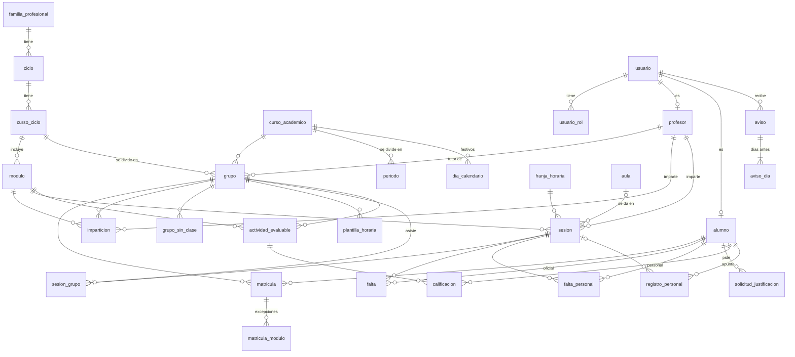

# Modelo de datos del Centro Integrado de FP

Base de datos para gestionar usuarios, clases y asistencia de **todo el centro**. Los datos reales cargados son los de 2.º ASIR 2026-27. Motor: **SQLite** (≥ 3.37).

| Fichero | Qué es |
|---|---|
| `db/schema.sql` | Tablas, claves, restricciones `CHECK` y triggers |
| `db/views.sql` | Horario, horas por módulo, asistencia oficial y personal, faltas por trimestre, discrepancias |
| `db/seed_2asir.sql` | Datos de 2.º ASIR (grupos A y B). **Generado**, no se edita a mano |
| `db/generar_seed.js` | Genera el seed a partir de `js/script.js`: `node db/generar_seed.js` |
| `db/pruebas.py` | 31 pruebas sobre una copia en memoria: `python3 db/pruebas.py` |

Crear la base de datos (con el cliente `sqlite3` o desde cualquier lenguaje):

```sh
sqlite3 cifp.db < db/schema.sql
sqlite3 cifp.db < db/views.sql
sqlite3 cifp.db < db/seed_2asir.sql
```

## Decisiones

- **Faltas en dos tablas.**
  - `falta` es el registro **oficial**: lo escribe el profesor al pasar lista, y el tutor gestiona las justificaciones.
  - `falta_personal` es el seguimiento del **alumno** (lo que hace hoy la app). Nunca cuenta como oficial.
  - `v_faltas_discrepancias` muestra en qué se diferencian.
- **Horario por sesiones reales.** En 2.º ASIR el horario cambia de un miércoles a otro, así que cada clase es una fila de `sesion`. Para los grupos con horario semanal fijo existe `plantilla_horaria`, de la que la API puede generar las sesiones.
- **Clases conjuntas.** Una sesión puede darse a varios grupos a la vez (`sesion_grupo`), para agrupamientos o desdobles. En el horario actual de 2.º ASIR A y B no comparten ninguna clase.
- **Asistencia sobre el curso completo.** Se calcula igual que la app (`renderAttendanceBars()`): el trimestre solo sirve para filtrar.
  - Umbral y si cuentan las justificadas: tabla `configuracion`.
  - Faltas permitidas = parte entera de horas × 20 %.
  - Estado: `riesgo` por debajo del umbral, `aviso` hasta 10 puntos por encima, `ok` a partir de ahí.
- **Claves reales en vez de posiciones.** La app guarda sus registros por posición en `CALENDAR_DATES`. Aquí cada registro apunta a una sesión o a una fecha concreta, así que añadir fechas no mueve los datos.

## Diagrama entidad-relación



## Tablas

**Estructura académica**

| Tabla | Contenido |
|---|---|
| `configuracion` | Una fila: nombre del centro, umbral de asistencia (80 %), si cuentan las faltas justificadas |
| `curso_academico` / `periodo` | 2026-27 y sus trimestres. Los trimestres no pueden solaparse |
| `familia_profesional` → `ciclo` → `curso_ciclo` → `modulo` | IFC → ASIR (superior) → 2.º → ADE, IMW… (con el color de la app) |
| `grupo` | 2.º ASIR A / B: turno y tutor |
| `aula` | Aulas del centro |

**Personas**

| Tabla | Contenido |
|---|---|
| `usuario` + `usuario_rol` | Cuenta (email, hash de contraseña) y roles: `jefatura`, `profesor`, `alumno`. Una persona puede tener varios |
| `profesor`, `alumno` | Datos propios de cada perfil (NIA del alumno) |
| `matricula` | Alumno en un grupo, con altas y bajas. Puede estar en dos grupos (módulos pendientes) |
| `matricula_modulo` | Solo excepciones: módulos convalidados, exentos o pendientes |
| `imparticion` | Qué profesor da qué módulo a qué grupo. El módulo y el grupo deben ser del mismo curso (clave ajena compuesta) |

**Calendario y horario**

| Tabla | Contenido |
|---|---|
| `franja_horaria` | 18:15–19:10 … 21:55–22:45, con el descanso marcado |
| `dia_calendario` | Festivos y días no lectivos de todo el centro |
| `grupo_sin_clase` | Periodos sin clase de un grupo (formación en empresa, viajes) |
| `plantilla_horaria` | Horario semanal fijo, para los grupos que lo tienen |
| `sesion` + `sesion_grupo` | Cada clase real y los grupos que asisten |

**Asistencia y evaluación**

| Tabla | Contenido |
|---|---|
| `falta` | Falta oficial por sesión y alumno: injustificada, justificada o retraso |
| `falta_personal` | Anotación del alumno |
| `solicitud_justificacion` | Petición del alumno para justificar unas fechas. Al aprobarla, sus faltas pasan a justificadas (trigger) |
| `actividad_evaluable` + `calificacion` | Exámenes y tareas del profesor, con peso; notas y entregas |
| `registro_personal` | Exámenes, tareas y notas que se apunta el alumno. Pueden ir en una hora, en un día con clase o en un día sin clase |
| `aviso` + `aviso_dia` | Recordatorios de Android y sus días de antelación |

## Reglas que impone la propia base de datos

- Tipos estrictos (`STRICT`) y formatos de fecha (`AAAA-MM-DD`) y hora (`HH:MM`).
- Rangos: nota de 0 a 10, peso y umbral de 0 a 100, avisos de 1 a 30 días.
- Estados coherentes:
  - una solicitud resuelta tiene quién la resolvió y cuándo;
  - una tarea tiene estado y una nota no;
  - un registro sin módulo no tiene peso ni nota.
- Horario sin choques:
  - un aula o un profesor no pueden tener dos clases que se solapen;
  - un grupo tampoco;
  - no hay clases en el descanso, en festivos ni en los periodos sin clase del grupo.
- Solo se registran faltas de alumnos matriculados en un grupo de esa sesión y dentro de sus fechas de alta y baja.

> SQLite solo comprueba las claves ajenas si se activa `PRAGMA foreign_keys = ON` en **cada conexión**. La API debe hacerlo siempre al abrir la base de datos.

## Permisos (los aplica la API)

SQLite no tiene usuarios ni roles, así que es la API la que decide qué puede ver y hacer cada perfil:
1. Identifica al usuario (login).
2. Consulta sus roles en `usuario_rol`.
3. Filtra cada consulta con estas reglas.

| Datos | Alumno | Profesor | Jefatura |
|---|---|---|---|
| Estructura, franjas, festivos, módulos, aulas, profesorado | Ver | Ver | Gestionar |
| Usuarios y matrículas | Solo los suyos | Alumnado de sus grupos | Gestionar |
| Sesiones | Las de sus grupos | Las de sus grupos y las suyas; marcarlas impartidas o canceladas | Gestionar |
| `falta` (oficial) | **Solo ver** las suyas | Ver las de sus grupos; **crear o cambiar** en sus sesiones, o en las de su grupo si es tutor | Gestionar |
| `falta_personal`, `registro_personal`, `aviso` | Solo las suyas (crear, cambiar, borrar) | Sus avisos | Sin acceso: agenda privada |
| `solicitud_justificacion` | Crear (siempre `pendiente`) y ver las suyas | Resolver las de su alumnado si es tutor | Gestionar |
| `actividad_evaluable`, `calificacion` | Ver las de sus grupos y sus notas | Crear y calificar en los módulos que imparte | Gestionar |

Consultas tipo, con `:yo` como id del usuario autenticado:
- Faltas oficiales del alumno: `SELECT … FROM falta WHERE alumno_id = :yo`
- Sesiones en las que el profesor pasa lista: `SELECT s.* FROM sesion s WHERE s.profesor_id = :yo OR EXISTS (SELECT 1 FROM sesion_grupo sg JOIN grupo g ON g.id = sg.grupo_id WHERE sg.sesion_id = s.id AND g.tutor_id = :yo)`

## Equivalencia con la app actual

| En `js/script.js` | En la base de datos |
|---|---|
| `MODULES` (nombre, docente, aula, color) | `modulo`, `profesor` + `usuario`, `imparticion`, `aula` |
| `TIME_SLOTS` | `franja_horaria` |
| `CALENDAR_DATES` (y sus `holiday`) | Fechas de `sesion`; festivos en `dia_calendario` |
| Rangos de la pestaña «Trimestre» | `periodo` |
| `SCHEDULE_A` / `SCHEDULE_B` | `sesion` + `sesion_grupo` |
| `userEvents` → falta por hora o día | `falta_personal` (y, del profesor, `falta`) |
| `userEvents` → examen / tarea / nota | `registro_personal` (con `sesion_id`; `por_dia` = `byDay`) |
| `personalEvents` (días sin clase) | `registro_personal` sin sesión ni módulo |
| `notify` / `notifyDays` | `aviso` + `aviso_dia` |
| `renderAttendanceBars()` | `v_asistencia` / `v_asistencia_personal` |

## Incidencias detectadas en los datos actuales

El generador encontró **3 choques de aula**. El horario oficial (`2ASIR-SEMI-1.pdf`) asigna un aula por módulo, no por clase, y en estas tres horas A y B tienen módulos distintos en el Aula 235 a la vez:
- 2 dic, 20:00: SRD (A) y ADE (B).
- 13 ene, 20:00: ADE (A) y SGY (B).
- 5 may, 21:05: SGY (A) y SOJ (B).

En el seed, la clase del grupo B queda **sin aula (por confirmar)**. Cuando se sepa el aula real, basta con un `UPDATE` de `sesion.aula_id`.

## Siguientes fases (fuera de esta)

1. **API** con login (hash de contraseñas en `usuario.password_hash`) que aplique la tabla de permisos. Debe abrir SQLite en modo WAL (`PRAGMA journal_mode = WAL`) para que las lecturas no esperen a las escrituras.
2. **App**:
   - descargar el horario en lugar de tenerlo en `js/script.js`;
   - enviar las faltas personales y los registros;
   - migrar una vez lo que ya hay en `localStorage`;
   - permiso INTERNET en Android.
3. **Panel web** para jefatura y profesorado: altas, horarios y pasar lista.
4. **Protección de datos (RGPD)**:
   - el centro es el responsable del tratamiento;
   - alojamiento en la UE;
   - copias de seguridad: basta con copiar el fichero `.db` con la API parada, o usar `.backup`.
